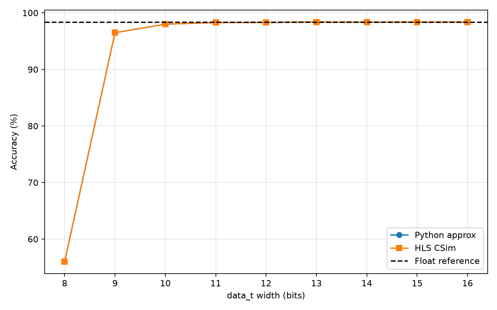
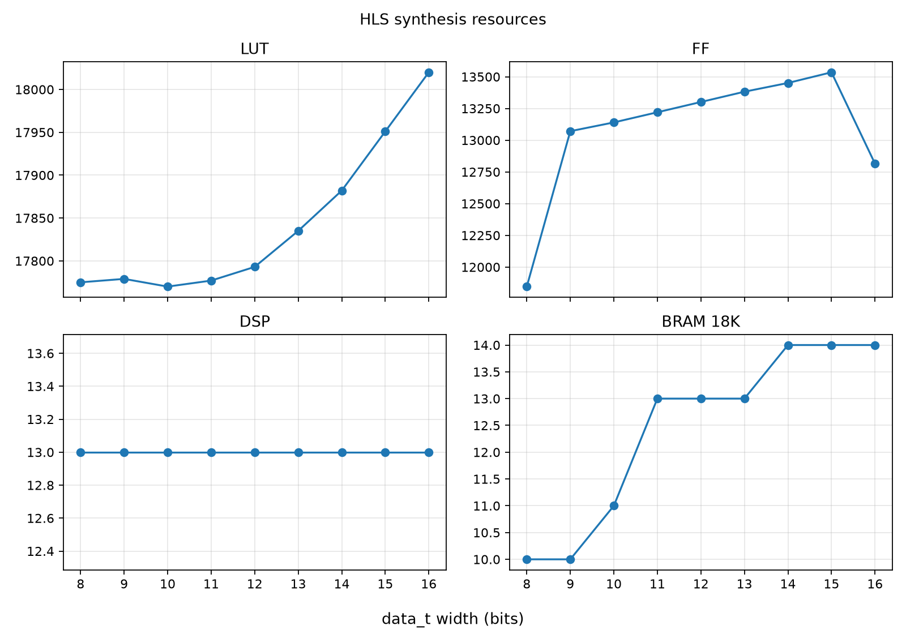

# FPGA LeNet HLS

本仓库实现面向 MNIST 的 LeNet 推理加速器，使用 Vivado/Vitis HLS 完成功能仿真和
综合验证。当前主线为任务 2（LeNet 路线），Level 1 的标准 MNIST 验证已通过；
Level 2 自采数据仍是后续工作。新增跨层FC资源复用实验已完成C仿真和HLS综合。

## 当前结果

| 项目 | 状态 | 证据 |
| --- | --- | --- |
| Level 1 MNIST（10,000 样本） | PASS | [Level 1 摘要](level1/results/level1_summary.md) |
| 16 位浮点/定点对照 | 98.37% / 98.38%，预测一致率 99.99% | [机器可读报告](level1/results/validation_report.json) |
| 定点位宽扫描 W=8..16 | COMPLETE | [整理版报告与图表](level1/results/numerical_precision/) |
| 推荐配置 | `data_t = ap_fixed<10,6,AP_RND,AP_SAT>` | HLS ≥90%，相对 16 位损失 ≤0.5 pp |
| Level 2 自采数据 | 待完成 | [Level 2 说明](level2/README.md) |
| 跨层FC资源复用 | 1000张全部logits一致；DSP 10→3，BRAM 13→46 | [实验报告、原始结果和RTL](resource_reuse/README.md) |

定点扫描使用官方 MNIST test split、XC7Z020、10 ns 目标周期和 Vitis HLS 2025.2.1。
W10 是满足门槛的最小位宽：HLS 准确率 98.00%，相对 W16 损失 0.38 个百分点；
综合估计 LUT 节省 1.39%、BRAM18K 节省 21.43%，DSP 不变，延迟处于同一估计量级。

## 目录

- [`level1/`](level1/)：LeNet HLS 源码、testbench、验证工具和运行说明。
- [`level1/results/numerical_precision/`](level1/results/numerical_precision/)：可直接审阅的位宽扫描结果、CSV 和图表。
- [`level2/`](level2/)：真实场景预处理和压力测试工具。
- [`resource_reuse/`](resource_reuse/)：16位、同工具原版/共享FC对比，含源码、1000张逐样本结果、综合报告、RTL与图表。
- [`docs/任务要求与LeNet路线核查.md`](docs/任务要求与LeNet路线核查.md)：课程要求与当前完成度核查。
- [`openspec/changes/add-numerical-precision-experiment/`](openspec/changes/add-numerical-precision-experiment/)：本次实验的 OpenSpec 设计与任务记录。

## 复现提示

完整实验需要 10,000 样本 blob、相邻元数据文件和可用的 HLS 环境。命令和数据准备
说明见 [`level1/README.md`](level1/README.md)。逐样本 CSV、HLS 日志和综合工作区
体量较大，按 `.gitignore` 保留在本地；仓库中的汇总材料足以审阅结果并指导复跑。
