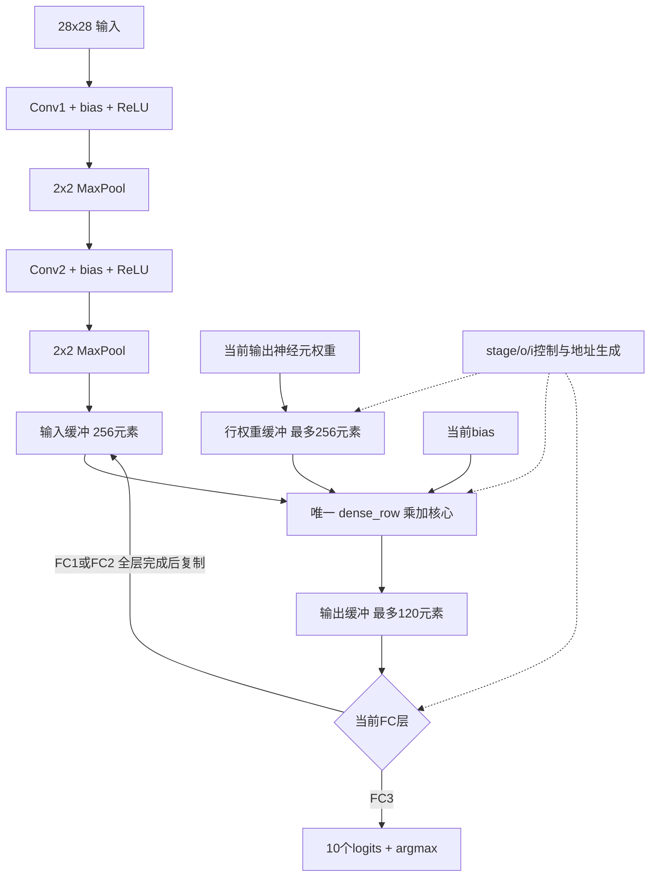

# LeNet存储与控制调度说明

## 数据通路

## 控制器与运算职责

控制由HLS将stage、o、i循环及函数调用映射为FSM。stage=0/1/2选择FC1/FC2/FC3，输入长度依次256/120/84，输出长度120/84/10。控制顺序为加载一行权重→选择bias→调用共享乘加核→保存一个输出，所有输出完成后才复制输入缓冲。不能在计算一层时逐项覆盖输入，否则会破坏后续神经元计算。

运算核心dense_row初始化32位累加器为bias，按i顺序乘累加，转回16位，FC1/FC2加ReLU，FC3保留logits。INLINE off与单一调用点形成一个共享实例，六个新旧配置的顶层RTL均经过实例数检查。流水化实验只改变该核心的循环调度，不改变数学求和顺序。

## 存储与地址

Conv1权重地址为(oc*5+ky)*5+kx；Conv2为((oc*6+ic)*5+ky)*5+kx。FC地址为o*inputs+i。Pool2按channel/y/x展平为256个输入。卷积/池化中间特征图是静态片上数组，FC使用输入256、输出120和权重行256元素缓存；存储实际映射以综合报告为准。

原16位整层缓存需要30720个权重槽；逐行缓存仅256槽。混合精度版本进一步将权重槽设为8位，输入/输出/bias仍16位。它没有减少每次推理需要读取的权重数量，也未实现跨图片权重常驻或DMA双缓冲。

## AXI组织

原版gmem0承载image/logits，gmem1承载全部权重和bias。混合位宽时，8位权重与16位bias在gmem1混用导致HLS禁用卷积权重的自动burst。分接口版将bias移至gmem0，使两个bundle内部各自同宽；仍为两个AXI主接口。AXI-Lite control保留参数基址和启动/完成控制。

Csim忽略接口时序，因此只靠Csim无法证明访存性能。本次接口对照附带综合日志与周期范围；实际RTL周期目前只验证了16位逐行缓存版。
