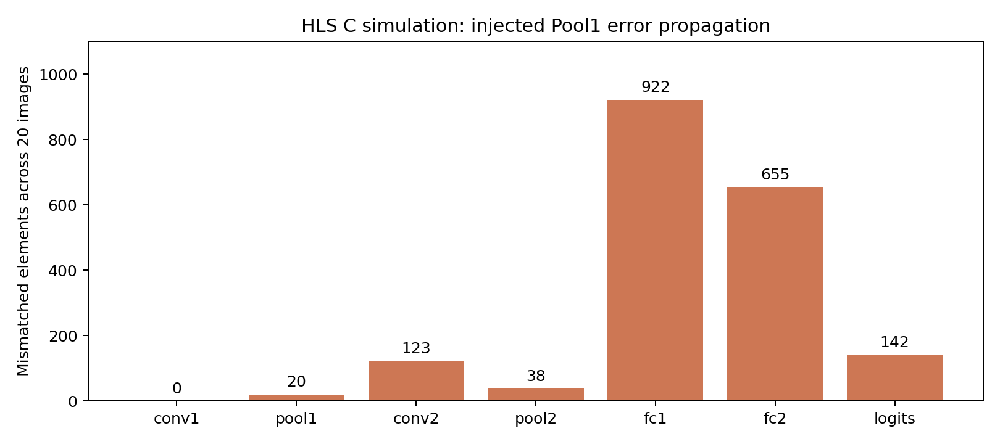

# 逐层参考验证与故障定位（HLS C仿真已通过）

E盘恢复后，已完成20张HLS正常/故障两组C仿真：7层共116280个数值逐位一致，20/20定位到正确注入点。见[HLS实验报告](results/hls_experiment_report.md)与[验证JSON](results/hls_layer_verification.json)。



| 已完成 | 结果 |
|---|---|
| 独立整数定点模型 vs 已有HLS | 1000张、10000个logits逐位一致 |
| 20张分层Python参考与浮点误差分析 | 7个观测层，原始压缩轨迹、CSV及特征图已留存 |
| Python故障注入定位器自检 | 20/20定位到Pool1索引0；另通过3项边界/轨迹完整性测试 |
| 混合精度完整集Python确认 | W8 I1权重、16位激活：9840/10000，98.40%；前1000张与已有混合精度HLS全部logits一致 |

历史记录：此前E盘未挂载，启动失败日志保留在[记录](results/hls_unavailable/run.log)。该阻塞现已解除。以下离线结果也继续保留。

[实验报告](results/experiment_report.md) · [离线摘要](results/offline_summary.json) · [完整集Python结果](results/python_mixed_full10000.json)


## 当前可复现

仓库根目录运行，需要Python、numpy、matplotlib；blob准备见[level1](../level1/README.md)，与已有实验保持相同模型及顺序：

```powershell
python -m unittest discover -s layer_validation/tools -p test_reference.py
python layer_validation/tools/audit.py --blob resource_reuse/results/mnist.bin
python layer_validation/tools/full_candidate.py --blob resource_reuse/results/mnist.bin
python layer_validation/tools/report.py
```

这些命令重建离线结果，原输入blob不上传。哈希用于检查是否与历史HLS实验使用相同数据和模型。

## 复现HLS逐层验证

使用实际HLS安装目录；以下流程已在2019.2运行成功：

```powershell
python layer_validation/tools/build_variant.py
python layer_validation/tools/run.py --blob resource_reuse/results/mnist.bin --hls-root E:/use/cpu/Vivado/2019.2
python layer_validation/tools/check_hls.py
python layer_validation/tools/report_hls.py
```

run.py分别执行正常和注入故障的C仿真，导出HLS中间轨迹。若clean/fault目录已经存在，先备份移至仓库外，避免覆盖原证据。check_hls.py只有拿到真实HLS成功日志及完整轨迹后才生成hls_layer_verification.json；本次已生成并提交该通过文件。

所有C++插桩位于非综合条件编译块内。原row_cache源码未修改；本目录没有新的综合或RTL仿真结果。10000张结果是Python参考，不替代完整HLS验收。
