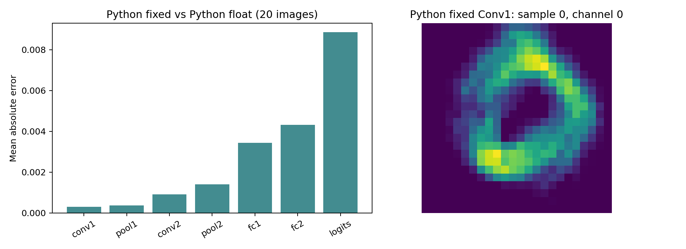

# 逐层参考验证与故障定位（HLS逐层验证待恢复环境）

本模块已完成可在当前机器运行的Python验证，未把无法运行的HLS验证写成通过。

| 已完成 | 结果 |
|---|---|
| 独立整数定点模型 vs 已有HLS | 1000张、10000个logits逐位一致 |
| 20张分层Python参考与浮点误差分析 | 7个观测层，原始压缩轨迹、CSV及特征图已留存 |
| Python故障注入定位器自检 | 20/20定位到Pool1索引0；另通过3项边界/轨迹完整性测试 |
| 混合精度完整集Python确认 | W8 I1权重、16位激活：9840/10000，98.40%；前1000张与已有混合精度HLS全部logits一致 |

**未完成：新的HLS逐层轨迹验证。** 原E盘及HLS安装当前不可访问，实际启动失败日志见[记录](results/hls_unavailable/run.log)。不修改磁盘挂载设置，不重装工具，不冒充硬件结果。

[实验报告](results/experiment_report.md) · [离线摘要](results/offline_summary.json) · [完整集Python结果](results/python_mixed_full10000.json)



## 当前可复现

仓库根目录运行，需要Python、numpy、matplotlib；blob准备见[level1](../level1/README.md)，与已有实验保持相同模型及顺序：

```powershell
python -m unittest discover -s layer_validation/tools -p test_reference.py
python layer_validation/tools/audit.py --blob resource_reuse/results/mnist.bin
python layer_validation/tools/full_candidate.py --blob resource_reuse/results/mnist.bin
python layer_validation/tools/report.py
```

这些命令重建离线结果，原输入blob不上传。哈希用于检查是否与历史HLS实验使用相同数据和模型。

## 恢复HLS后

先恢复安装盘或指定实际HLS目录；以下脚本已编写，当前环境下尚未验证运行成功：

```powershell
python layer_validation/tools/build_variant.py
python layer_validation/tools/run.py --blob resource_reuse/results/mnist.bin --hls-root E:/use/cpu/Vivado/2019.2
python layer_validation/tools/check_hls.py
```

run.py分别执行正常和注入故障的C仿真，导出HLS中间轨迹。若clean/fault目录已经存在，先备份移至仓库外，避免覆盖原证据。check_hls.py只有拿到真实HLS成功日志及完整轨迹后才生成hls_layer_verification.json；目前仓库没有该通过文件。

所有C++插桩位于非综合条件编译块内。原row_cache源码未修改；本目录没有新的综合或RTL仿真结果。10000张结果是Python参考，不替代完整HLS验收。
