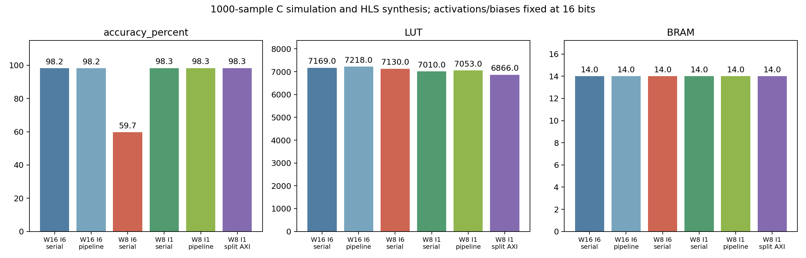
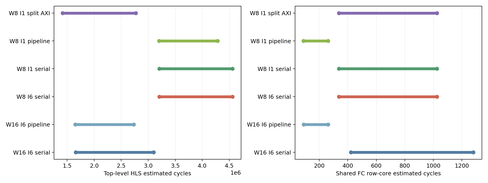
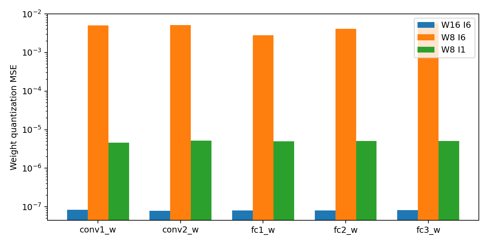

# 混合精度、共享FC流水化与AXI接口组织

完成五个新配置的1000张MNIST C仿真和HLS综合，并复用已有16位逐行缓存基线。所有配置均保留bias，无softmax。

| 对照 | 主要结果 |
|---|---|
| 权重8位、整数6位 vs 整数1位 | 准确率59.7% vs 98.3%，激活/bias保持16位 |
| FC流水开关 | 相同权重格式下全部1000条输出一致；16位流水版估计时钟10.601ns，未达到10ns目标 |
| 8位权重与16位bias分接口 | 输出一致；LUT 7010→6866，延迟估计范围降低，消除卷积权重的位宽混用burst警告 |

这是子集候选筛选，不替代原有完整10000张精度结果；流水化不是循环展开并行度扫描。

- [实验报告](results/experiment_report.md)
- [完整CSV](results/metrics.csv) / [JSON](results/metrics.json)
- [量化参数范围](results/parameter_ranges.csv)
- 各配置子目录：1000张逐样本结果、运行日志、综合XML/RPT和RTL。





## 复现

需要Python、numpy、matplotlib及Vivado HLS 2019.2。仓库根目录执行：

```powershell
python mixed_precision/tools/build_variant.py
python mixed_precision/tools/parameter_ranges.py resource_reuse/results/mnist.bin
python mixed_precision/tools/run.py --blob resource_reuse/results/mnist.bin --case w8i6_serial
python mixed_precision/tools/run.py --blob resource_reuse/results/mnist.bin --case w8i1_serial
python mixed_precision/tools/run.py --blob resource_reuse/results/mnist.bin --case w16i6_pipeline
python mixed_precision/tools/run.py --blob resource_reuse/results/mnist.bin --case w8i1_pipeline
python mixed_precision/tools/run.py --blob resource_reuse/results/mnist.bin --case w8i1_split
python mixed_precision/tools/report.py
```

blob来源见[level1](../level1/README.md)，需使用同一模型参数和MNIST顺序。已提交的配置目录须先备份移至仓库外，runner拒绝覆盖已有日志。输入bin和hls_work不上传。report固定核验当前1000张控制变量实验，运行其他样本数时不要把结果混入本次比较。

## 结论边界

优先候选为W8 I1串行分接口版，但仍需完整测试集确认，不能宣称全局最优。当前未完成这些混合精度变体的C/RTL协同仿真；另一个[RTL验证模块](../rtl_validation/README.md)只覆盖16位逐行缓存版。课程不要求上板。
