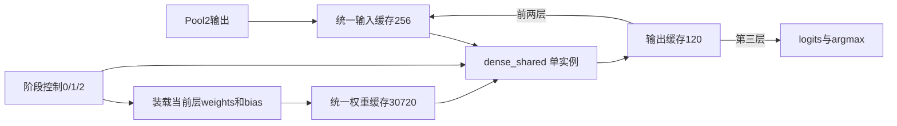

# 全连接层跨层资源复用

本实验对应老师的计算单元时分复用、控制调度和资源权衡要求。数值精度扫描继续使用同学已完成的[九档实验](../level1/results/numerical_precision/README.md)。

## 结构



计算核执行bias初始化、顺序乘加和可选ReLU。控制循环负责FC1/FC2/FC3尺寸、参数选择与数据搬运。原始level1网络保持不变，实验源码在 `src/lenet_shared.cpp`。

## 运行

先用Level 1工具生成完整MNIST blob。安装Python、NumPy和Matplotlib，在仓库根目录运行：

```powershell
python resource_reuse/tools/build_variant.py
python resource_reuse/tools/run.py --blob level1/data/lenet_accuracy_10000.bin --samples 1000 --width 16 --hls-root E:/use/cpu/Vivado/2019.2
python resource_reuse/tools/report.py
```

如果结果目录已经存在CSV，请先将整组旧结果移到归档目录，避免混用旧数据。生成的绝对路径脚本放在被Git忽略的hls_work中。

## 结果索引

- [实验报告](results/experiment_report.md)
- [机器可读汇总](results/summary.json)
- [数值一致性](results/comparison.json)
- [资源对比图](results/resources.png)
- `results/baseline/`、`results/shared/`：逐样本预测、运行日志、综合报告与RTL

所有比较采用同一工具、16位数据和相同1000张图。不要与Vitis 2025.2.1的资源数字直接计算优化比例。C仿真是定点软件数值验证，HLS综合是硬件估算。

真实照片采集仍未完成，本实验不涉及自采数据和上板。
