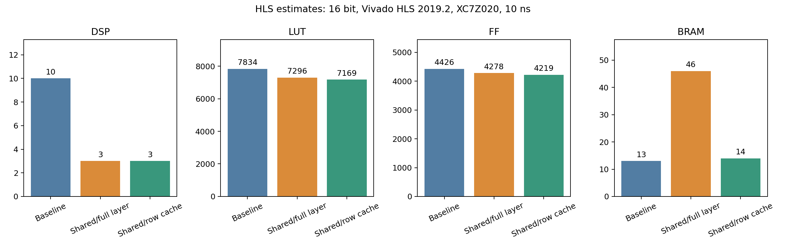
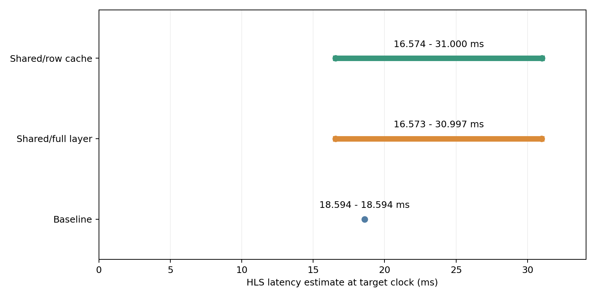

# 逐行权重缓存模块

本模块在跨层共享FC基础上优化片上存储：整层30720个权重的缓冲改为一行最多256个权重，保留共享乘加核、bias和无softmax的argmax输出。

1000张测试的预测及全部logits与前两版一致，准确率98.2%。HLS估计BRAM由整层缓存的46降至14（减少69.57%），DSP保持3，LUT 7296→7169，FF 4278→4219。

## 结果入口

- [完整实验报告](results/experiment_report.md)
- [三种架构对比CSV](results/metrics.csv)
- [一致性与单实例验证](results/verification.json)
- [原始仿真输出、日志、综合报告、RTL](results/row_cache/)
- [文件SHA-256](results/manifest.json)





## 复现

在仓库根目录运行（Python需要numpy和matplotlib，另需Vivado HLS 2019.2）：

```powershell
python row_cache/tools/build_variant.py
python row_cache/tools/run.py --blob resource_reuse/results/mnist.bin --samples 1000 --width 16 --hls-root E:/use/cpu/Vivado/2019.2
python row_cache/tools/report.py
```

blob由Level 1工具生成，使用与resource_reuse实验相同的参数和测试集顺序，输入文件不上传。参考[level1说明](../level1/README.md)。输出存在时runner拒绝覆盖；复跑前将已提交的results/row_cache目录移到仓库外备份。其他已提交汇总会由脚本重建。report.py要求前两版结果仍在resource_reuse/results，并验证输入、源头文件、testbench哈希一致。

此处固定16位以保证与前一模块控制变量一致，并未重新选择最佳定点位宽。核心代码由原版生成，卷积和池化不修改。图表是基于HLS综合报告的可视化，并非GUI或上板截图。

## 尚需收集

开发板和连接照片、实际运行输出截图、布局布线后的资源/时序截图。尚未完成RTL协同仿真和上板验证，不能据本实验声称实际吞吐提升。
