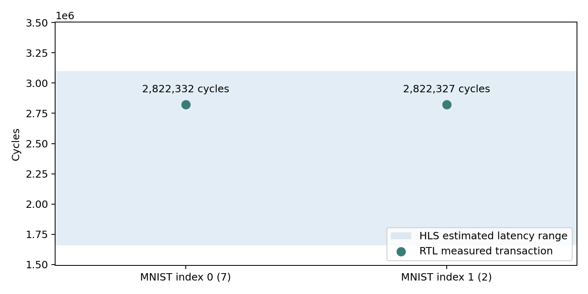

# 逐行缓存版C/RTL协同仿真

真实训练参数与两张MNIST图片在Vivado HLS 2019.2 / xsim中通过Verilog协同仿真。连续两次调用的预测为7和2，均正确；原始交易延迟为2822332和2822327周期。

- [实验报告](results/experiment_report.md)
- [原始协同仿真报告](results/row_cache/lenet_accel_cosim.rpt)
- [交易周期CSV](results/transactions.csv)
- [完整日志](results/row_cache/run.log)



## 复现

在仓库根目录运行，需要Vivado HLS 2019.2、Python、numpy和matplotlib：

```powershell
python rtl_validation/tools/run.py --blob resource_reuse/results/mnist.bin --samples 2
python rtl_validation/tools/report.py
```

使用同一Level 1参数和MNIST顺序；blob准备见[level1](../level1/README.md)。复跑前将results/row_cache备份移至仓库外，避免覆盖提交的原始证据。工具新建独立HLS工程，进行C仿真、综合和C/RTL协同仿真。report.py解析当前两交易实验。

仅覆盖16位逐行缓存版本，不覆盖所有混合精度变体。2/2是功能样例结果，不是完整数据集准确率。任务书不要求上板，本次没有上板或布局布线数据。
